# AI Chat Assistant - User Flows & Branching

## 1. Main Conversation Flow

## 2. Human Agent Handoff Decision Tree

## 3. User Journey States

## 4. Detailed Handoff Process Flow

```mermaid
sequenceDiagram
    participant User
    participant ChatUI
    participant AIBot
    participant HandoffSystem
    participant HumanAgent
    
    User->>ChatUI: Types "I need a human agent"
    ChatUI->>AIBot: Send message
    AIBot->>AIBot: Detect handoff trigger
    AIBot->>ChatUI: Display confirmation message
    AIBot->>HandoffSystem: Initiate transfer request
    
    HandoffSystem->>HandoffSystem: Queue user request
    HandoffSystem->>ChatUI: Show "Transferring..." system message
    ChatUI->>ChatUI: Update header (AI → Human)
    ChatUI->>ChatUI: Show handoff banner
    ChatUI->>ChatUI: Hide quick action buttons
    
    HandoffSystem->>HumanAgent: Notify agent with context
    HumanAgent->>HandoffSystem: Accept request
    HandoffSystem->>ChatUI: Update status "Agent connected"
    
    HumanAgent->>ChatUI: Send greeting message
    ChatUI->>User: Display agent message
    User->>ChatUI: Continue conversation
    ChatUI->>HumanAgent: Forward messages
    
    Note over HumanAgent,User: Human-assisted conversation continues
    
    HumanAgent->>ChatUI: Resolution provided
    User->>ChatUI: Thanks & goodbye
    HumanAgent->>ChatUI: Close conversation
    ChatUI->>User: Show feedback request
```

## 5. AI Response Decision Logic

## 6. Key Branching Scenarios

### Scenario A: Simple Question (AI Resolves)
1. User: "How do I reset my password?"
2. AI: Provides step-by-step instructions
3. User: "Thanks!"
4. AI: "You're welcome! Anything else?"
5. User: "No, that's all"
6. Chat ends successfully

### Scenario B: Complex Issue (AI → Human)
1. User: "My account was charged twice"
2. AI: "Let me look into billing issues..."
3. AI: Detects sensitive billing topic
4. AI: "I'll connect you with a specialist"
5. **HANDOFF TRIGGERED**
6. Human agent reviews charge
7. Agent processes refund
8. Issue resolved

### Scenario C: Explicit Human Request
1. User: "I want to talk to a person"
2. AI: "I'll connect you right away!"
3. **IMMEDIATE HANDOFF**
4. Human agent greets user
5. Agent assists with inquiry
6. Conversation continues with human

### Scenario D: Progressive Escalation
1. User asks question
2. AI provides answer
3. User: "That didn't work"
4. AI tries alternative solution
5. User: Still not working"
6. AI: After 3 attempts → "Let me connect you with a specialist"
7. **HANDOFF TRIGGERED**

## 7. UI State Changes During Handoff

```mermaid
graph LR
    A[AI Assistant State] -->|Handoff Trigger| B[Transition State]
    B -->|Update UI| C[Human Agent State]
    
    A1[Avatar: 🤖] --> B1[System Message]
    A2[Name: AI Assistant] --> B2[Show Banner]
    A3[Status: Always Available] --> B3[Hide Quick Actions]
    A4[Quick Action Buttons Visible] --> B4[Update Header]
    
    B1 --> C1[Avatar: 👤]
    B2 --> C2[Name: Agent Name]
    B3 --> C3[Status: Online]
    B4 --> C4[Quick Actions Hidden]
    
    style A fill:#667eea,color:#fff
    style B fill:#f59e0b,color:#fff
    style C fill:#3b82f6,color:#fff
```

## 8. Interaction Patterns Summary

| User Action | AI Response | Handoff? | Follow-up |
|-------------|-------------|----------|-----------|
| General question | Direct answer | ❌ No | Ask if helpful |
| Password reset | Instructions | ❌ No | Offer to send link |
| Billing issue | Initial info | ⚠️ Maybe | Escalate if sensitive |
| "Talk to human" | Acknowledge | ✅ Yes | Immediate transfer |
| Technical error | Troubleshoot | ⚠️ Maybe | After 2-3 attempts |
| Account closure | Acknowledge | ✅ Yes | Require human approval |
| Thanks/goodbye | Polite closing | ❌ No | End conversation |
| Frustrated tone | Empathy + options | ⚠️ Maybe | Offer human agent |

## Implementation Notes

1. **Trigger Keywords for Handoff:**
   - Explicit: "human", "agent", "representative", "person", "speak to someone"
   - Implicit: "frustrated", "not working", "still broken", "terrible service"
   - Sentiment: Negative sentiment score < -0.5

2. **Context Preservation:**
   - Full conversation history passed to human agent
   - User information and account details
   - Previous AI attempts and suggested solutions

3. **Response Time Expectations:**
   - AI: < 2 seconds
   - Human agent queue: 30-60 seconds
   - Human agent response: 1-3 minutes

4. **Analytics to Track:**
   - Handoff rate (target: < 15%)
   - AI resolution rate (target: > 85%)
   - User satisfaction scores
   - Average conversation length
   - Time to resolution
